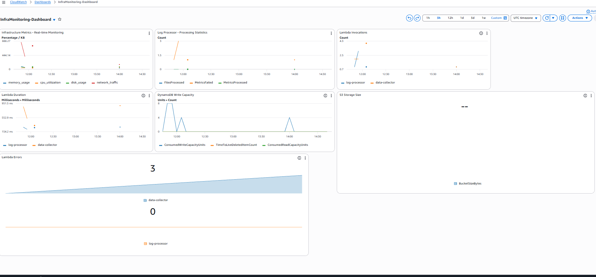

# Phase 7: CloudWatch Dashboard Creation

**Date Completed**: February 10, 2026  
**Duration**: 2 hours  
**Status**: ✅ Completed

## Overview

Created a comprehensive CloudWatch dashboard (`InfraMonitoring-Dashboard`) to visualize real-time infrastructure metrics, Lambda performance, DynamoDB operations, and S3 storage. This dashboard provides centralized monitoring for the entire data pipeline.

## Objectives

- ✅ Create a unified CloudWatch dashboard for all pipeline metrics
- ✅ Visualize infrastructure metrics (CPU, memory, disk, network)
- ✅ Monitor Lambda function performance and errors
- ✅ Track DynamoDB write capacity consumption
- ✅ Monitor S3 storage growth
- ✅ Capture screenshots for portfolio documentation

## Dashboard Configuration

### Dashboard Details

- **Name**: `InfraMonitoring-Dashboard`
- **Region**: eu-west-1 (Ireland)
- **Refresh Interval**: Auto-refresh enabled
- **Total Widgets**: 7

### Widget 1: Infrastructure Metrics - Real-time Monitoring

**Type**: Line chart  
**Metrics**:
- `cpu_utilization` (Percent)
- `memory_usage` (Percent)
- `disk_usage` (Percent)
- `network_traffic` (Kilobytes)

**Configuration**:
- Namespace: `InfraMonitoring`
- Dimension: Region = eu-west-1
- Statistic: Average
- Period: 5 minutes
- Y-axis label: Percentage / KB

**Purpose**: Real-time monitoring of synthetic infrastructure metrics generated by the data-collector Lambda function.


---

### Widget 2: Log Processor - Processing Statistics

**Type**: Line chart  
**Metrics**:
- `FilesProcessed` (Count)
- `MetricsProcessed` (Count)
- `MetricsFailed` (Count)

**Configuration**:
- Namespace: `InfraMonitoring/LogProcessor`
- Statistic: Sum
- Period: 5 minutes
- Y-axis label: Count

**Purpose**: Track the log-processor Lambda's file processing performance and error rates.


---

### Widget 3: Lambda Function Invocations

**Type**: Line chart  
**Metrics**:
- `data-collector` → Invocations
- `log-processor` → Invocations

**Configuration**:
- Namespace: `AWS/Lambda`
- Dimension: By Function Name
- Statistic: Sum
- Period: 5 minutes
- Y-axis label: Count

**Purpose**: Monitor Lambda invocation frequency to ensure EventBridge and S3 triggers are working correctly.


---

### Widget 4: Lambda Execution Duration

**Type**: Line chart  
**Metrics**:
- `data-collector` → Duration
- `log-processor` → Duration

**Configuration**:
- Namespace: `AWS/Lambda`
- Dimension: By Function Name
- Statistic: Average
- Period: 5 minutes
- Y-axis label: Milliseconds

**Purpose**: Track Lambda execution times to identify performance bottlenecks and optimize function efficiency.


---

### Widget 5: DynamoDB Write Capacity

**Type**: Line chart  
**Metrics**:
- `InfraMetrics` → ConsumedWriteCapacityUnits

**Configuration**:
- Namespace: `AWS/DynamoDB`
- Dimension: Table Metrics
- Statistic: Sum
- Period: 5 minutes
- Y-axis label: Units

**Purpose**: Monitor DynamoDB write capacity consumption to ensure the table can handle the data ingestion rate.


---

### Widget 6: Lambda Error Count

**Type**: Number widget  
**Metrics**:
- `data-collector` → Errors
- `log-processor` → Errors

**Configuration**:
- Namespace: `AWS/Lambda`
- Dimension: By Function Name
- Statistic: Sum
- Period: 1 hour

**Purpose**: Display total Lambda errors in the last hour for quick health checks.


---

### Widget 7: S3 Storage Size

**Type**: Number widget  
**Metrics**:
- `infra-monitoring-pipeline-data` → BucketSizeBytes → StandardStorage

**Configuration**:
- Namespace: `AWS/S3`
- Dimension: Storage Metrics
- Statistic: Average
- Period: 1 day

**Purpose**: Track S3 bucket storage growth to monitor data accumulation and plan for storage costs.


---

## Complete Dashboard View


---

## Key Learnings

### 1. CloudWatch Metrics Publishing

**Challenge**: Initial metrics were not appearing in CloudWatch due to incorrect array indexing in the Lambda code.

**Solution**: Fixed the `cloudwatch.put_metric_data()` call to use correct array indices (`metrics[0]['value']`, `metrics[1]['value']`, etc.) instead of `metrics['value']`.

**Code Fix**:
```python
cloudwatch.put_metric_data(
    Namespace='InfraMonitoring',
    MetricData=[
        {
            'MetricName': 'cpu_utilization',
            'Value': float(metrics[0]['value']),  # Fixed: correct index
            'Unit': 'Percent',
            'Timestamp': datetime.utcnow(),
            'Dimensions': [
                {'Name': 'Region', 'Value': 'eu-west-1'}
            ]
        },
        # ... other metrics
    ]
)
```

### 2. Region-Specific Metrics

**Challenge**: Metrics were appearing with `us-west-2` region dimension instead of `eu-west-1`.

**Solution**: 
- Explicitly specified `region_name='eu-west-1'` in all boto3 client initializations
- Added `Dimensions` to each CloudWatch metric with `Region: eu-west-1`

**Code Fix**:
```python
# Initialize clients with explicit region
cloudwatch = boto3.client('cloudwatch', region_name='eu-west-1')

# Add dimensions to metrics
'Dimensions': [
    {'Name': 'Region', 'Value': 'eu-west-1'}
]
```

### 3. Error Handling and Logging

**Best Practice**: Added try-except blocks around CloudWatch publishing with logging to debug issues:

```python
try:
    response = cloudwatch.put_metric_data(...)
    print(f'Successfully published metrics to CloudWatch: {response}')
except Exception as cw_error:
    print(f'Error publishing to CloudWatch: {str(cw_error)}')
```

This helped identify that metrics were being published successfully (HTTP 200 status) even when they weren't immediately visible in the console.

### 4. Metric Visibility Delay

**Observation**: CloudWatch metrics take 2-3 minutes to appear in the console after being published.

**Best Practice**: Always wait 2-3 minutes and refresh the CloudWatch Metrics page before troubleshooting.

---

## Technical Implementation

### Data-Collector Lambda Updates

**Final Working Code** (key sections):

```python
import boto3
from datetime import datetime
from decimal import Decimal

# Initialize clients with explicit region
s3_client = boto3.client('s3', region_name='eu-west-1')
dynamodb = boto3.resource('dynamodb', region_name='eu-west-1')
cloudwatch = boto3.client('cloudwatch', region_name='eu-west-1')

def lambda_handler(event, context):
    try:
        timestamp = int(time.time())
        
        # Generate 4 infrastructure metrics
        metrics = [
            {'metric_type': 'cpu_utilization', 'value': Decimal(str(random.uniform(20.0, 80.0))), ...},
            {'metric_type': 'memory_usage', 'value': Decimal(str(random.uniform(30.0, 90.0))), ...},
            {'metric_type': 'disk_usage', 'value': Decimal(str(random.uniform(40.0, 85.0))), ...},
            {'metric_type': 'network_traffic', 'value': Decimal(str(random.uniform(100.0, 1000.0))), ...}
        ]
        
        # Save to DynamoDB
        table = dynamodb.Table('InfraMetrics')
        for metric in metrics:
            table.put_item(Item=metric)
        
        # Save to S3
        s3_client.put_object(
            Bucket='infra-monitoring-pipeline-data',
            Key=f'raw-metrics/{datetime.utcnow().strftime("%Y/%m/%d")}/metrics-{timestamp}.json',
            Body=json.dumps(metrics, default=str)
        )
        
        # Publish to CloudWatch
        cloudwatch.put_metric_data(
            Namespace='InfraMonitoring',
            MetricData=[
                {
                    'MetricName': 'cpu_utilization',
                    'Value': float(metrics[0]['value']),
                    'Unit': 'Percent',
                    'Timestamp': datetime.utcnow(),
                    'Dimensions': [{'Name': 'Region', 'Value': 'eu-west-1'}]
                },
                # ... other 3 metrics
            ]
        )
        
        return {'statusCode': 200, 'body': json.dumps({'message': 'Success'})}
    
    except Exception as e:
        print(f'Error: {str(e)}')
        return {'statusCode': 500, 'body': json.dumps({'error': str(e)})}
```

---

## Dashboard Benefits

1. **Centralized Monitoring**: Single pane of glass for all pipeline metrics
2. **Real-time Visibility**: 5-minute refresh intervals for near real-time monitoring
3. **Performance Tracking**: Lambda duration and invocation metrics help identify bottlenecks
4. **Error Detection**: Dedicated error count widget for quick health checks
5. **Resource Planning**: S3 storage and DynamoDB capacity metrics aid in cost forecasting
6. **Portfolio Documentation**: Professional screenshots demonstrate AWS monitoring expertise

---

## File Structure for Phase 7 Screenshots

```
aws-data-pipeline/
├── screenshots/
│   └── phase7-cloudwatch/
│       ├── cloudwatch-dashboard-full.png
│       ├── widget-infrastructure-metrics.png
│       ├── widget-processing-statistics.png
│       ├── widget-lambda-invocations.png
│       ├── widget-lambda-duration.png
│       ├── widget-dynamodb-writes.png
│       ├── widget-lambda-errors.png
│       └── widget-s3-storage.png
├── docs/
│   ├── phase1-iam-setup.md
│   ├── phase2-s3-dynamodb-setup.md
│   ├── phase3-data-collector.md
│   ├── phase4-lambda-deployment.md
│   ├── phase5-log-processor-development.md
│   ├── phase6-log-processor-deployment.md
│   └── phase7-cloudwatch-dashboard.md  ← This file
└── README.md
```

---

## Screenshot Organization

All screenshots saved to: `C:\Users\davoduo\Documents\aws-data-pipeline\screenshots\phase7-cloudwatch/`

### Screenshot Files

1. **cloudwatch-dashboard-full.png** - Complete dashboard view showing all 7 widgets
2. **widget-infrastructure-metrics.png** - CPU, memory, disk, network line chart
3. **widget-processing-statistics.png** - Files/metrics processed line chart
4. **widget-lambda-invocations.png** - Lambda invocation counts
5. **widget-lambda-duration.png** - Lambda execution times
6. **widget-lambda-duration.png** - Lambda execution times
7. **widget-dynamodb-writes.png** - DynamoDB write capacity
8. **widget-lambda-errors.png** - Error count number widget
9. **widget-s3-storage.png** - S3 bucket size number widget

### Referencing Screenshots in Documentation

In your `docs/phase7-cloudwatch-dashboard.md` file, screenshots are referenced using relative paths:

```markdown
## Dashboard Screenshots

### Full Dashboard View


### Individual Widgets


```

---

## Next Steps

- **Phase 8**: Create CloudWatch Alarms for automated alerting
  - CPU utilization > 80%
  - Lambda errors > 0
  - DynamoDB throttling events
  - S3 storage growth rate

---

## Completion Checklist

- ✅ Created InfraMonitoring-Dashboard in CloudWatch
- ✅ Added 7 widgets covering all key metrics
- ✅ Fixed data-collector Lambda CloudWatch publishing
- ✅ Verified all metrics appearing in eu-west-1 region
- ✅ Captured 8 screenshots for portfolio
- ✅ Organized screenshots in phase7-cloudwatch folder
- ✅ Documented technical implementation and learnings
- ✅ Created file structure documentation
- ✅ Ready for Phase 8: CloudWatch Alarms

**Phase 7 Status**: ✅ **COMPLETED** - February 10, 2026
